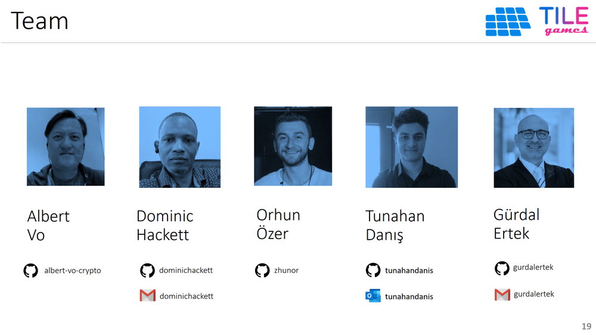

 

### Background

1. The inspiration of the TILE Games project was to develop an integrated **P2E + Advertisement + DAO platform.** 
2. To the best of our knowledge, this is to be the first platform of its kind for the Oasis ecosystem. 
3. Since we did not encounter such a system before, our system can also serve as an **Oasis-first boilerplate for developer community.**
4. Oasis developers can develop similar GameFi platforms in the future with much **shorter life cycles, turning Oasis into a hub of GameFi.**
5. Specifically, it will now be easier for developers to use the Oasis Network to develop new **GameFi platforms with built-in advertisement monetization through governance.**
6. In addition to being first proof-of-concept MVP of its kind, the TILE Games platform itself, when many players play, can itself **increase the visibility, popularity, and usage of Oasis Protocol, and bring transactional volume to the ROSE token.**
 

Our team consists of professionals from varying backgrounds, united with the ethos of **creating value through innovation**.

 

**Index**

1. **Background**
2. [Unique Value Proposition](UniqueValueProposition.md)
3. [System Architecture](SystemArchitecture.md)
4. [Tokenomics](Tokenomics.md)
5. [Backend](Backend.md)
6. [Frontend](Frontend.md)
7. [Game A: Crypto Shooter](GameA.md)
8. [Game B: Crypto Cards](GameB.md)
9. [Technology/Tool Stack](TechnologyStack.md)
10. [Future Work for TILE Games](FuturePlans.md)
11. [Branding](Branding.md)

<hline></hline>

[Back to Main GitHub Page](../README.md) | [Back to Documentation Index Page](Documentation.md)
