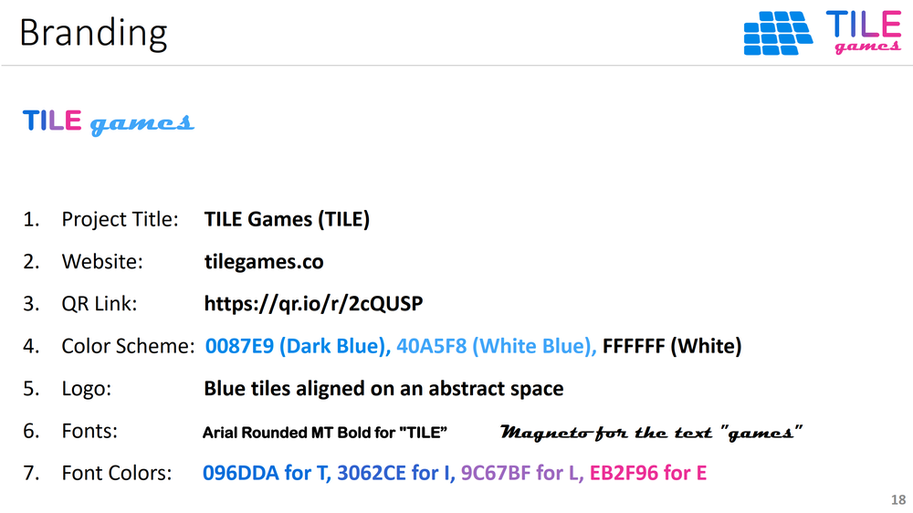

 

## TILE Games - Branding

[TILE Games](https://github.com/albert-vo-crypto/tile-games) is a **P2E GameFi  + Ad + DAO platform on Oasis**, with built-in governance & monetization. Users play casual games to earn TILE crypto tokens. Funding for the distributed tokens inflows from ad revenues.

This following figure presents the branding standards for TILE Games;

 

## Index

1. [Background](Background.md)
2. [Unique Value Proposition](UniqueValueProposition.md)
3. [System Architecture](SystemArchitecture.md)
4. [Tokenomics](Tokenomics.md)
5. [Backend](Backend.md)
6. [Frontend](Frontend.md)
7. [Game A: Crypto Shooter](GameA.md)
8. [Game B: Crypto Cards](GameB.md)
9. [Technology/Tool Stack](TechnologyStack.md)
10. [Future Work for TILE Games](FuturePlans.md)
11. **Branding**

<hline></hline>

[Back to Main GitHub Page](../README.md) | [Back to Documentation Index Page](Documentation.md)
