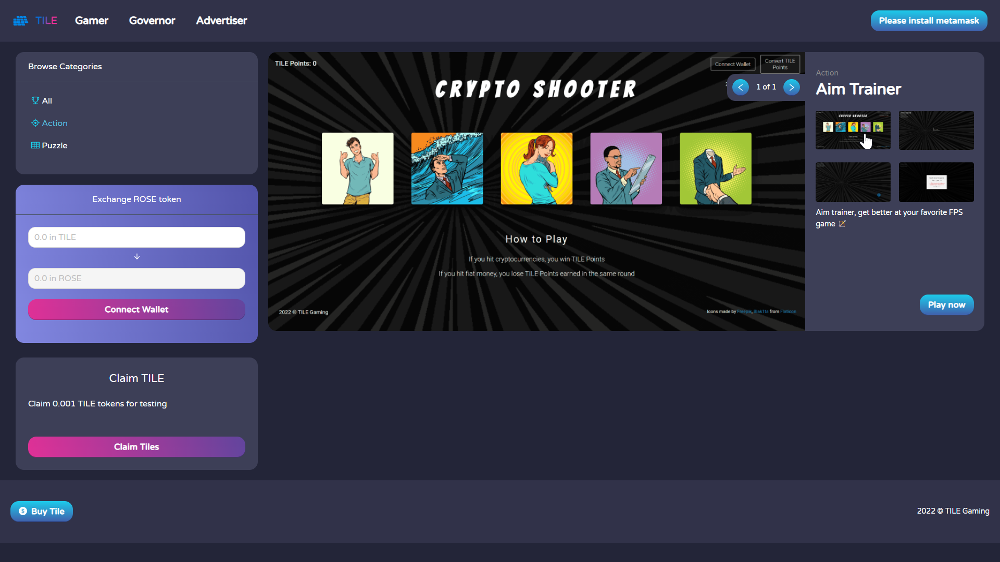

 

## TILE Games - Documentation

[**TILE Games**](https://github.com/albert-vo-crypto/tile-games) is a **P2E GameFi  + Ad + DAO platform on Oasis**, with built-in governance & monetization. Users play casual games to earn TILE crypto tokens. Funding for the distributed tokens inflows from ad revenues.

This documentation presents details on the TILE Games dapp and project.

### START HERE:

- [**TILE Games Dapp**](https://tile-gaming.vercel.app/) is running live on the cloud.
- [**Documentation**](./Documentation.md) describes the project and the dapp in detail.
- [**Slide Deck**](https://_____) describes the project.
- [**YouTube Video**](https://_____) is the demo video for the hackathon.

## Index

1. [Background](Background.md)
2. [Unique Value Proposition](UniqueValueProposition.md)
3. [System Architecture](SystemArchitecture.md)
4. [Tokenomics](Tokenomics.md)
5. [Backend](Backend.md)
6. [Frontend](Frontend.md)
7. [Game A: Crypto Shooter](GameA.md)
8. [Game B: Crypto Cards](GameB.md)
9. [Technology/Tool Stack](TechnologyStack.md)
10. [Future Work for TILE Games](FuturePlans.md)
11. [Branding](Branding.md)

<hline></hline>

[Back to Main GitHub Page](../README.md) | [Back to Documentation Index Page](Documentation.md)

### TILE Games Main Window

## Project Team

Our team consists of professionals from varying backgrounds, united with the ethos of **creating value through innovation**.

 
