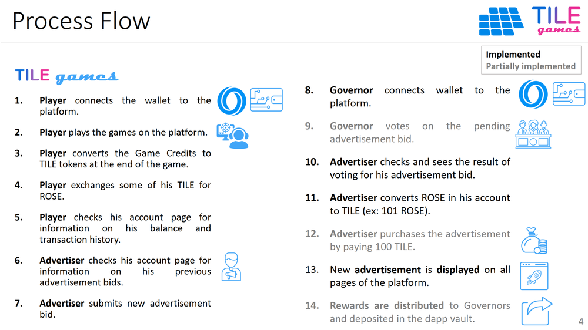

 

## Frontend

### Process Flow

Assumption: In the current implementation, every Player is also a potential Advertiser. So, these two menus will be displayed to all. Governor menu is displayed only to those connected wallets that have the Governor NFT.

1. **Player** connects the wallet to the platform.
2. **Player** plays the games on the platform.
3. **Player** converts the Game Credits to TILE tokens at the end of the game.
4. **Player** exchanges some of his TILE for ROSE.
5. **Player** checks his account page for information on his balance and transaction history.
6. **Advertiser** checks his account page for information on his previous advertisement bids.
7. **Advertiser** submits new advertisement bid.
8. **Governor** connects wallet to the platform.
9. **Governor** votes on the pending advertisement bid. (Partially implemented)
10. **Advertiser** checks and sees the result of voting for his advertisement bid.
11. **Advertiser** converts ROSE in his account to TILE (ex: 101 ROSE).
12. **Advertiser** purchases the advertisement by paying 100 TILE.  (Partially implemented)
13. New **advertisement is displayed** on all pages of the platform.
14. **Rewards are distributed** to Governors and deposited in the dapp vault. (Partially implemented)

 

### Built-in TILE Games
1. As a part of the hackathon submission, TILE Games platform includes **two original, custom-developed, Oasis-themed, P2E Crypto Games,** both developed using JavaScript. So, within this submission, there are actually **three projects, a GameFi platform and two P2E games.**
2. The major design requirements for the games were to be **playable, bug free, open-source** (so that the team can check for security) and that the games contain standard code snippets that are called to interact with the Oasis network through the TILE Games Platform.
3. The first built-in crypto game is [**Crypto Shooter**](https://github.com/tunahandanis/demo-aim-game), where crypto enthusiasts practice their reflex motor skills by catching crypto coins (+1 point each), but avoiding fiat currencies (-1 point each).
4. The second built-in crypto game is [**Crypto Cards**](https://github.com/tunahandanis/memory-game), where crypto enthusiasts improve their memory by matching card pairs with the same crypto coin logos. 
5. This is the first time, to the best of our knowledge, that a **gaming platform** is developed **with ready Oasis-themed games** in it at the moment of submission to a hackathon.
6. **All content** in the games (images, icons, music, sound) are **provably copyright-granted** to one of the team members. Proof documents can be presented upon request.
7. The platform is designed such that other P2E games, especially open-source JavaScript games, can be added to the platform just by adding certain standard code snippets to interact with the platform.
8. New games can be submitted by any creator to the Developer Team and then are uploaded. 
9. The platform is composable; in the future, new games can be embedded into the platform through direct uploading of the docker file, zip file or submission of the GitHub repository link and then the approval of the game by the Developer Team. 

## Design Principles

When designing the **dapp**, [DDP: Decentralisation Design Principles](https://github.com/thisisbullish/ddp) by [thisisbullish](https://github.com/thisisbullish) was taken as a guiding source. 

When designing the **user interface (UI)**, the [Gestalt Principles](https://www.interaction-design.org/literature/topics/gestalt-principles) of School of [M. Wertheimer (Wertheimer, 2020)](https://link.springer.com/book/10.1007/978-3-030-36063-4) and the knowledge visualization guidelines of [Eppler and Burkhard (2008)](https://www.igi-global.com/chapter/knowledge-visualization/25136) were applied. 

In **coding** the system, best effort was done to adhere to some of the [best practices of coding](https://code.tutsplus.com/tutorials/top-15-best-practices-for-writing-super-readable-code--net-8118).

**Index**

1. [Background](Background.md)
2. [Unique Value Proposition](UniqueValueProposition.md)
3. [System Architecture](SystemArchitecture.md)
4. [Tokenomics](Tokenomics.md)
5. [Backend](Backend.md)
6. **Frontend**
7. [Game A: Crypto Shooter](GameA.md)
8. [Game B: Crypto Cards](GameB.md)
9. [Technology/Tool Stack](TechnologyStack.md)
10. [Future Work for TILE Games](FuturePlans.md)
11. [Branding](Branding.md)

<hline></hline>

[Back to Main GitHub Page](../README.md) | [Back to Documentation Index Page](Documentation.md)
