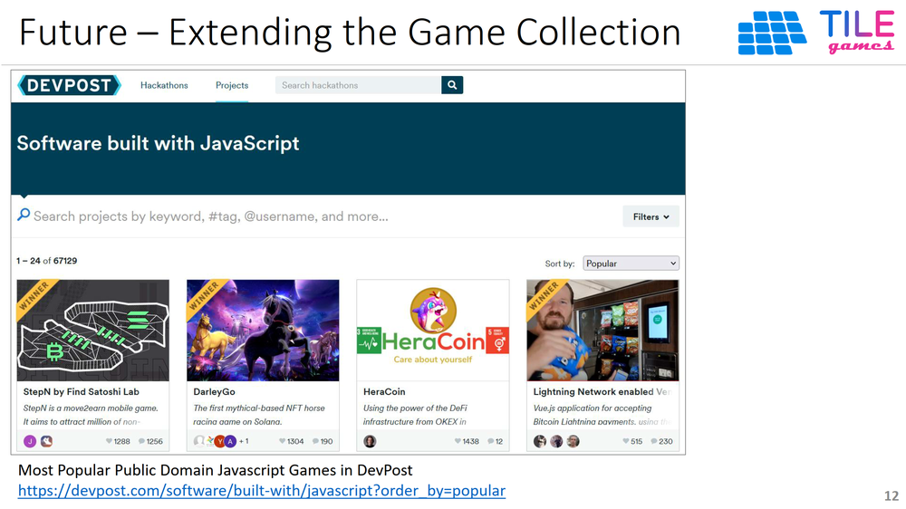
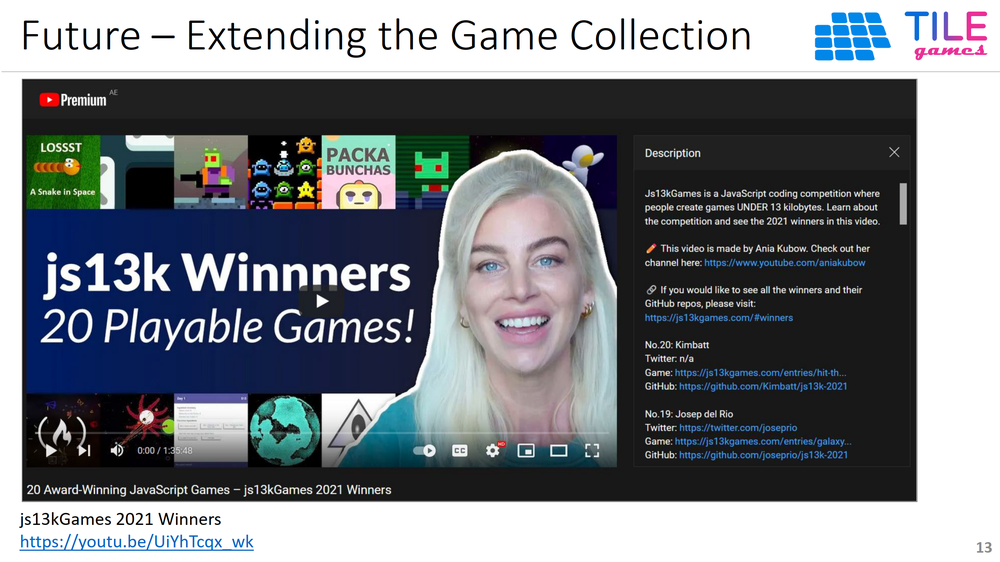
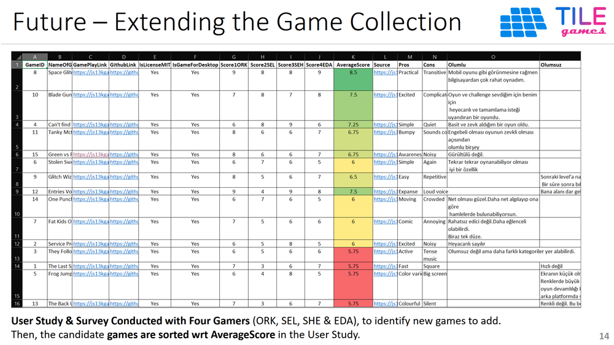

 

## Future Work for TILE Games


### Future Extensions
1. In the future version of the platform, the Governors (G) will also earn tokens for their role in governance. 
2. Players with a certain amount of staked TILE tokens to become Governors. 
3. In other words, the planned full model for TILE Games is Play-to-Earn P2E + Play-to-Govern P2G + Govern-to-Earn G2E = P2G2E.
4. There can be an exchange rate for TILE/ROSE that dynamically changes based on balance of game vault, advertisement revenues, number of players, and amount of gameplay. 
5. TILE tokens distributed to players can also change based on advertisement revenues, number of players, and amount of gameplay. 
6. Advertisers can select which game to place the ads to. The platform may automatically air drop free ad placements to other games. 
7. Ad revenue can go to a specific game which is selected for the ad, as well as the platform, players of that game, players at large, creator of that game, and players at large.
8. The vault can distribute the revenues to users, purchase back and burn TILE tokens, and  buy ROSE algorithmically to sustain the tokenomics.
9. There can be staking rewards for TILE tokens that are not withdrawn. Staking rewards can be in both TILE and in ROSE.
10. The developer team can add new casual games. A user study and survey has readily been conducted to identify best new public domain games to include into the system.
11. Game Creators, as a new type of stakeholder in the system, can be allowed to submit games, and upon publishing of their games, receive TILE tokens based on the TILE tokens distributed for their games and the number of players of that game. 
12. Players can give ratings to the games, where the ratings have weights based on their TILE holdings.
13. Advertisers can view statistics / analytics for the game plays, deciding which game to put the ad into.
14. Built-in analytics dashboards can display statistics for games, guiding gamers to play the most profitable games.

### Future Tokenomics: Scenarios and Token Distribution
1. Vault full of ROSE, few players: 
Distribute a lot of TILE, which makes the players happy, and brings new players.
2. Vault full of ROSE, too many players
Distribute less TILE but then there will be more ad revenue soon so we can distribute more ROSE if we sustain too many players.
3. Vault has less ROSE, few player
Vicious cycle (Danger Zone): Pump ROSE from outside, or burn native token
4. Vault has less ROSE, many players
Distribute less TILE but then there will be more ad revenue soon so we can distribute more TILE if we sustain too many players.

### Extending the Game Collection
The game collection within TILE Games can be extended by importing readily-developed games in open-source repositories, especially those under [MIT license](https://mit-license.org/). Here are some sources of such games:
1. [Most Popular Javascript Games in DevPost](https://devpost.com/software/built-with/javascript?order_by=popular)
2. [js13kGames 2021 Winners YouTube video](https://youtu.be/UiYhTcqx_wk)
3. [js13kGames 2020 Winners YouTube video](https://youtu.be/GKOgm5-GbUA)
4. [js13kGames All Projects](https://js13kgames.com/)
5. [js13kGames All Winners](https://js13kgames.com/#winners)
6. [Atari Games in Javascript](https://www.youtube.com/results?search_query=code+atari+game+in+javascript)

The following figures display two of the alternatives:

 
 

To investigate which public domain games can be added to extend TILE Games, a User Study & Survey was conducted with four gamers (ORK, SEL, SHE & EDA). Then, given their scores, the candidate games are sorted wrt AverageScore in the User Study. The following figure displays the result of the User Study & Survey:

 

### Code Snippets to Embed into New Games

```js
// Function that converts Game Points to TILE tokens
// Add to the main/home/index page of the game
const claimTile = async () => {
    try {
      const { ethereum } = window;

      const provider = new ethers.providers.Web3Provider(ethereum);
      const signer = provider.getSigner();
      const connectedContract = new ethers.Contract(
        contractAddress,
        contractABI,
        signer
      );

      const tokenToClaim = points / 10000;

      let transaction = await connectedContract.claimTile(
        ethers.utils.parseUnits(tokenToClaim.toString(), "ether")
      );

      await transaction.wait();

      updatePoints(0);

      console.log(transaction);
      console.log(consoleMsg);
    } catch (error) {
      console.log(error);
    }
  };
  
// Function that sets the game points. Insert at every point where game points are changed.
setPoints(newPoint);
  };
```

**Index**

1. [Background](Background.md)
2. [Unique Value Proposition](UniqueValueProposition.md)
3. [System Architecture](SystemArchitecture.md)
4. [Tokenomics](Tokenomics.md)
5. [Backend](Backend.md)
6. [Frontend](Frontend.md)
7. [Game A: Crypto Shooter](GameA.md)
8. [Game B: Crypto Cards](GameB.md)
9. [Technology/Tool Stack](TechnologyStack.md)
10. **Future Work for TILE Games**
11. [Branding](Branding.md)


<hline></hline>

[Back to Main GitHub Page](../README.md) | [Back to Documentation Index Page](Documentation.md)
