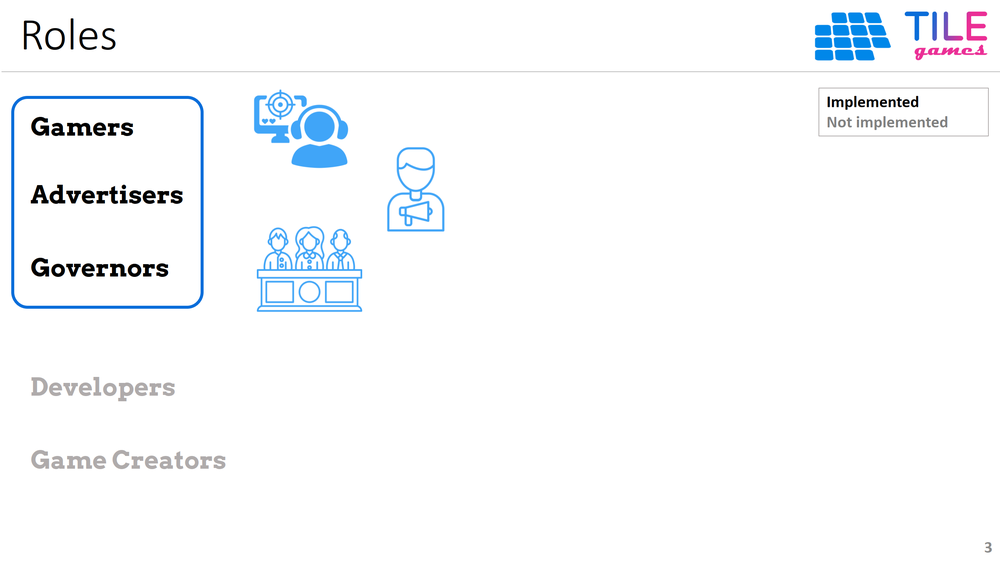
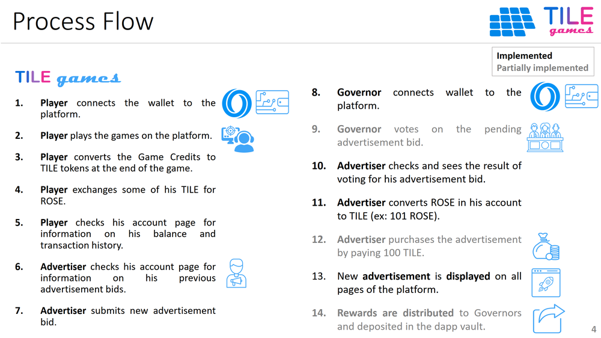

 

## System Architecture

The participants into the TILE Games platform are illustrated in the following figure:

 

The process flow in the dapp is illustrated in the following figure:

 

**Index**

1. [Background](Background.md)
2. [Unique Value Proposition](UniqueValueProposition.md)
3. **System Architecture**
4. [Tokenomics](Tokenomics.md)
5. [Backend](Backend.md)
6. [Frontend](Frontend.md)
7. [Game A: Crypto Shooter](GameA.md)
8. [Game B: Crypto Cards](GameB.md)
9. [Technology/Tool Stack](TechnologyStack.md)
10. [Future Work for TILE Games](FuturePlans.md)
11. [Branding](Branding.md)

<hline></hline>

[Back to Main GitHub Page](../README.md) | [Back to Documentation Index Page](Documentation.md)
