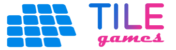

 

## Tokenomics

1. The platform has its **native TILE token,** which is the token earned by Gamers through game play, and to be distributed as reward to Governors.
2. In the current implementation of the platform, 1 TILE = 1 ROSE.
3. The platform can host a practically unlimited number of games, as long as the games interact with the platform using some standard code snippets.
4. The platform and all its games **all run under the Oasis Network**. 
5. The only **gateway into the system is the ROSE token**, both for advertisers and players/moderators. In other words, TILE can be purchased only with ROSE token in the platform and converted only to ROSE. 
6. Being the financial gateway to the platform, **usage of ROSE** token can be expected to increase.
7. In the future version of the platform, the Governors (G) will also earn tokens for their role in governance. Another future extension is giving the chance to players with sufficient staked TILE tokens to become Governors, so they can also earn from by governing. 
8. In other words, the **planned full model** for TILE Games is **Play-to-Earn P2E + Play-to-Govern P2G + Govern-to-Earn G2E = P2G2E.**

### Future Extensions to Tokenomics
1. In the future version of the platform, the Governors (G) will also earn tokens for their role in governance. 
2. Players with a certain amount of staked TILE tokens to become Governors. 
3. In other words, the planned full model for TILE Games is Play-to-Earn P2E + Play-to-Govern P2G + Govern-to-Earn G2E = P2G2E.
4. There can be an exchange rate for TILE/ROSE that dynamically changes based on balance of game vault, advertisement revenues, number of players, and amount of gameplay. 
5. TILE tokens distributed to players can also change based on advertisement revenues, number of players, and amount of gameplay. 
6. Advertisers can select which game to place the ads to. The platform may automatically air drop free ad placements to other games. 
7. Ad revenue can go to a specific game which is selected for the ad, as well as the platform, players of that game, players at large, creator of that game, and players at large.
8. The vault can distribute the revenues to users, purchase back and burn TILE tokens, and  buy ROSE algorithmically to sustain the tokenomics.
9. There can be staking rewards for TILE tokens that are not withdrawn. Staking rewards can be in both TILE and in ROSE.
10. The developer team can add new casual games. A user study and survey has readily been conducted to identify best new public domain games to include into the system.
11. Game Creators, as a new type of stakeholder in the system, can be allowed to submit games, and upon publishing of their games, receive TILE tokens based on the TILE tokens distributed for their games and the number of players of that game. 
12. Players can give ratings to the games, where the ratings have weights based on their TILE holdings.

### Future Tokenomics: Scenarios and Token Distribution
1. Vault full of ROSE, few players: 
Distribute a lot of TILE, which makes the players happy, and brings new players.
2. Vault full of ROSE, too many players
Distribute less TILE but then there will be more ad revenue soon so we can distribute more ROSE if we sustain too many players.
3. Vault has less ROSE, few player
Vicious cycle (Danger Zone): Pump ROSE from outside, or burn native token
4. Vault has less ROSE, many players
Distribute less TILE but then there will be more ad revenue soon so we can distribute more TILE if we sustain too many players.

**Index**

1. [Background](Background.md)
2. [Unique Value Proposition](UniqueValueProposition.md)
3. [System Architecture](SystemArchitecture.md)
4. **Tokenomics**
5. [Backend](Backend.md)
6. [Frontend](Frontend.md)
7. [Game A: Crypto Shooter](GameA.md)
8. [Game B: Crypto Cards](GameB.md)
9. [Technology/Tool Stack](TechnologyStack.md)
10. [Future Work for TILE Games](FuturePlans.md)
11. [Branding](Branding.md)

<hline></hline>

[Back to Main GitHub Page](../README.md) | [Back to Documentation Index Page](Documentation.md)
