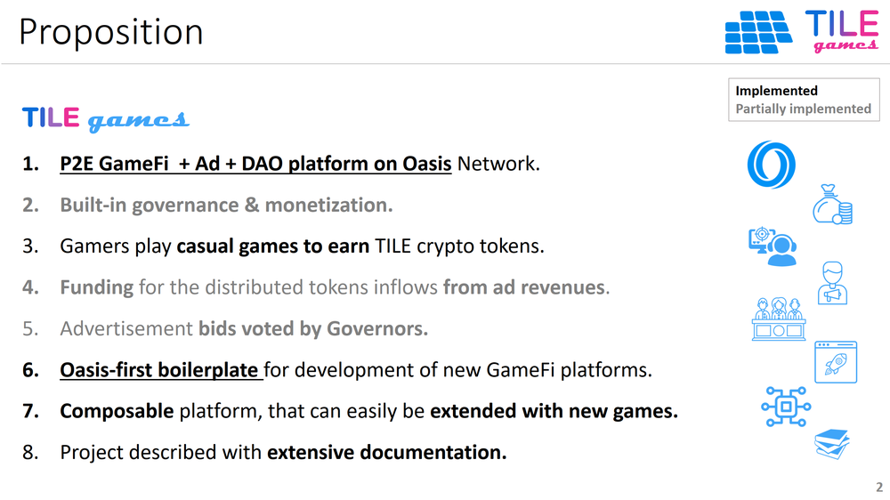

 

## Unique Value

### TILE Games - Description:

P2E GameFi  + Ad + DAO platform on Oasis, with built-in governance & monetization. Users play casual games to earn TILE crypto tokens. Funding for the distributed tokens inflows from ad revenues.

### What it does

1. Tile Games (TILE) is a **P2E GameFi + Ad + DAO platform.** 
2. In the TILE platform, Gamers play **casual JavaScript games to earn crypto tokens.** 
3. The **funding** for the token distribution comes **from** revenues of **advertisements,** which are submitted by Advertisers (A). 
4. **Governors (G) vote for acceptance/rejection** of advertisement bids. 
5. The platform is **composable; new games can be embedded** into the platform through simple snippets.

### Product Proposition

 

### Unique Value Proposition

TILE Games brings the following **value offerings to blockchain world**, as well as **Oasis Ecosystem**:

1. The inspiration of the TILE Games project was to develop an integrated **P2E + Advertisement + DAO platform.**. This goal has been accomplished, even though some components of the system are not yet fully functional.
2. To the best of our knowledge, this is to be the first platform of its kind for the Oasis ecosystem. 
3. Since we did not encounter such a system before, our system can also serve as an **Oasis-first boilerplate for developer community.**
4. Oasis developers can develop similar GameFi platforms in the future with much **shorter life cycles, turning Oasis into a hub of GameFi.**
5. Specifically, it will now be easier for developers to use the Oasis Network to develop new **GameFi platforms with built-in advertisement monetization through governance.**
6. In addition to being first proof-of-concept MVP of its kind, the TILE Games platform itself, when many players play, can itself **increase the visibility, popularity, and usage of Oasis Protocol, and bring transactional volume to the ROSE token.**

**Index**

1. [Background](Background.md)
2. **Unique Value Proposition**
3. [System Architecture](SystemArchitecture.md)
4. [Tokenomics](Tokenomics.md)
5. [Backend](Backend.md)
6. [Frontend](Frontend.md)
7. [Game A: Crypto Shooter](GameA.md)
8. [Game B: Crypto Cards](GameB.md)
9. [Technology/Tool Stack](TechnologyStack.md)
10. [Future Work for TILE Games](FuturePlans.md)
11. [Branding](Branding.md)

<hline></hline>

[Back to Main GitHub Page](../README.md) | [Back to Documentation Index Page](Documentation.md)
